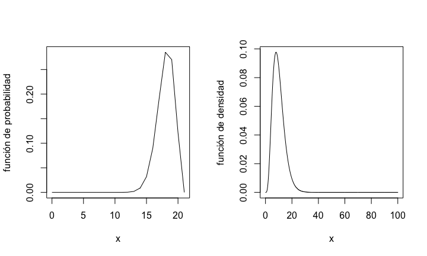
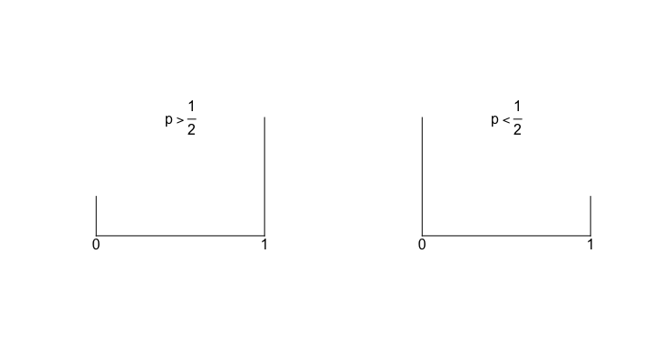
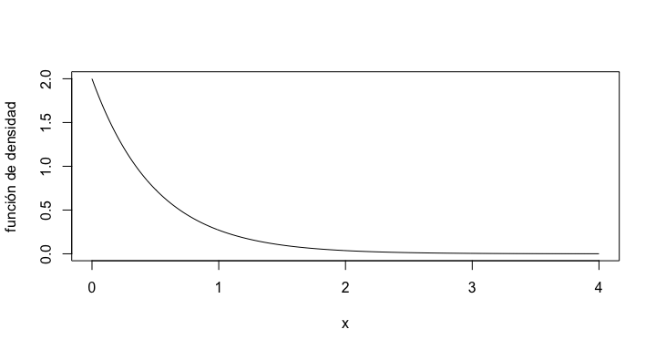
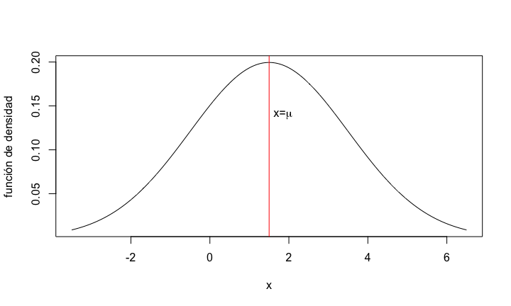
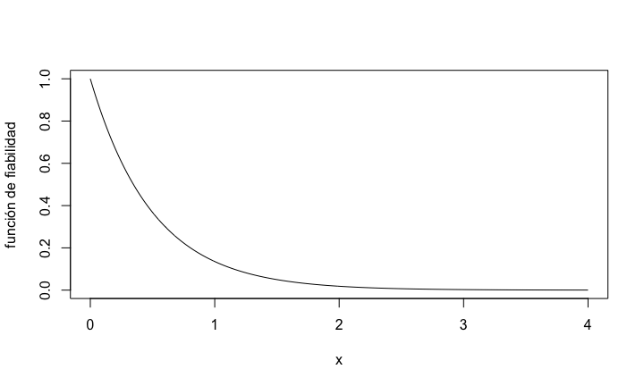
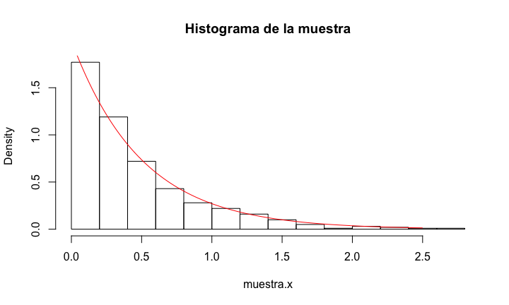
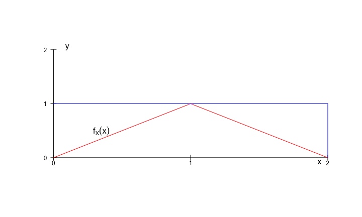
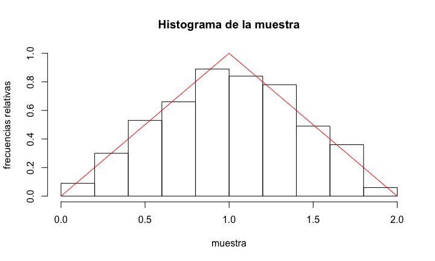
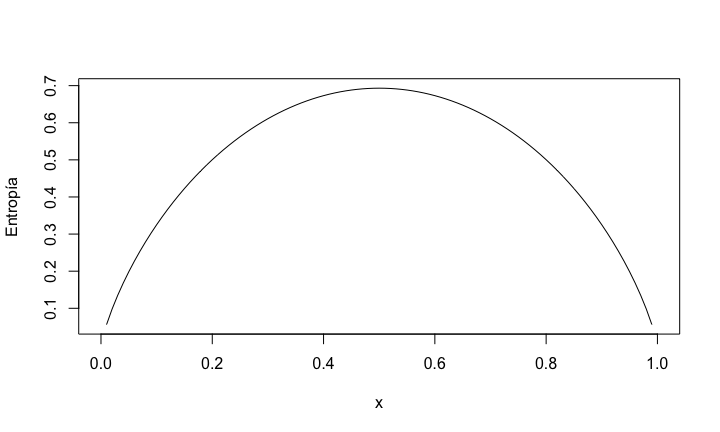
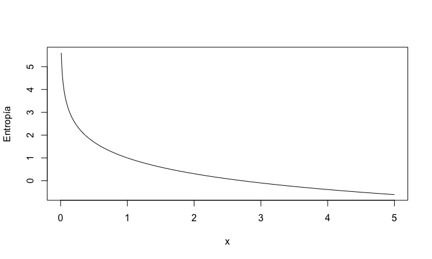

\newcommand\momento{m}
\newcommand{\momentocentral}{\mu}
\newcommand{\FunGenMom}{m}
\newcommand{\FunCar}{\phi}
\newcommand{\Entropia}{H}

# Momentos de variables aleatorias

## Momento de orden $n$ de una variable aleatoria

<l class="definition"> Definición. </l> 
Sea $X$ una variable aleatoria. Definimos el **momento de orden $n$** como 
$\momento_n = E\left(X^n\right)$.

<l class="observ"> Observación.</l>
El momento de orden $1$ de una variable aleatoria es su valor medio o $E(X)$.

Los momentos de orden $n$ caracterizan una variable $X$. O sea, que si conocemos todos los momentos de orden $n$, podemos deducir cuál es la distribución de $X$.

En general, el cálculo de los momentos de orden $n$ para una variable $X$ es bastante tedioso. 


## Ejemplo momento de orden $n$
<div class="example">
**Ejemplo: momento de orden $n$ de una variable de Bernoulli de parámetro $p$**

Sea $X$ una variable de Bernoulli de parámetro $p$. Recordemos que su función de probabilidad es:
$$
P_X(0)=q=1-p,\ p_X(1)=p.
$$
Su momento de orden $n$ será:
$$
\momento_n = E\left(X^n\right)=p\cdot 1^n+(1-p)\cdot 0^n = p.
$$
En este caso, todos los momentos de orden $n$ valen $p$.

</div>


## Ejemplo momento de orden $n$
<div class="example">
**Ejemplo: momento de orden $n$ de una variable exponencial de parámetro $\lambda$**

Consideremos ahora una variable $X$ exponencial de parámetro $\lambda$.

Recordemos que su función de densidad es: $f_X(x)=\lambda \mathrm{e}^{-\lambda x},$ para $x\geq 0$ y $0$, en caso contrario.

Su momento de orden $n$ será:
$$
\momento_n = E\left(X^n\right)=\int_0^\infty \lambda \mathrm{e}^{-\lambda x} x^n\, dx =\frac{n!}{\lambda^n}.
$$

La expresión anterior se puede obtener integrando por partes $n$ veces y resolviendo los límites correspondientes. Dejámos al lector los cálculos correspondientes.

Fijémonos que los momentos de orden $n$ tienden a infinito a medida que $n$ crece: $\lim\limits_{n\to\infty}\momento_n = \lim\limits_{n\to\infty}\frac{n!}{\lambda^n}=\infty$.
</div>

## Ejemplo momento de orden $n$
<div class="example">
**Ejemplo: momento de orden $n$ de una variable normal de parámetros $\momento=0$ y $\sigma =1$**

Recordemos que su función de densidad es: $f_X(x)=\frac{1}{\sqrt{2\pi}}\mathrm{e}^{-\frac{x^2}{2}},$ para $x\in \mathbb{R}$.

Su momento de orden 1 será la esperanza de $X$: $\momento_1 = 0$ i su momento de orden 2 será: 
$\momento_2 = E\left(X^2\right)=\int_{-\infty}^\infty \frac{1}{\sqrt{2\pi}}\mathrm{e}^{-\frac{x^2}{2}}\cdot x^2\, dx = 1.$
La integral anterior se resuelve usando técnicas de integrales de dos variables. 
Dicho valor también se puede obtener usando que su varianza vale 1:
$\momento_2 = \mathrm{Var}(X)+E(X)^2 = \sigma^2 +0^2 = 1.$

Los momentos de orden impar $n$ serán cero ya que integramos una función impar:
$\momento_n = E\left(X^n\right)=\int_{-\infty}^\infty \frac{1}{\sqrt{2\pi}}\mathrm{e}^{-\frac{x^2}{2}}\cdot x^n\, dx = 0.$
O sea, si consideramos $g(x)=\frac{1}{\sqrt{2\pi}}\mathrm{e}^{-\frac{x^2}{2}}\cdot x^n$, se verifica $g(-x)=-g(x)$, para todo $x\in\mathbb{R}$.

Si intentamos calcular el momento de orden 4, obtenemos:
$\momento_4 = E\left(X^4\right)=\int_{-\infty}^\infty \frac{1}{\sqrt{2\pi}}\mathrm{e}^{-\frac{x^2}{2}}\cdot x^4\, dx = 3,$ usando técnicas de integración de dos variables otra vez.

</div>


## Momento central de orden $n$ de una variable aleatoria
<l class="definition"> Definición. </l> 
Sea $X$ una variable aleatoria. Definimos el **momento central de orden $n$** como 
$\momentocentral_n = E\left((X-\mu)^n\right)$, donde $\mu =E(X)$ es la media o la esperanza de la variable aleatoria $X$.

<l class="observ"> Observación.</l>
El momento central de orden $1$ de una variable aleatoria es siempre 0:
$$
\momentocentral_1 = E\left((X-\mu)\right)=E(X)-E(\mu)=E(X)-E(X)=0.
$$

## Momento central de orden $n$ de una variable aleatoria

<l class="observ"> Observación.</l>
El momento central de orden $2$ de una variable aleatoria es la varianza:
$$
\momentocentral_2 = E\left((X-\mu)^2\right):= \mathrm{Var}(X).
$$

Los momentos centrales de orden $n$ caracterizan también una variable $X$. O sea, que si conocemos todos los momentos centrales de orden $n$, podemos deducir cuál es la distribución de $X$. 

## Momento central de orden $n$ de una variable aleatoria

<l class="prop"> Proposición.</l>
La relación que hay entre los momentos centrales y los momentos de una variable aleatoria es la siguiente:
$$
\momentocentral_n = \sum_{k=0}^n (-1)^{n-k} \binom{n}{k} \mu^{n-k} \momento_k = \sum_{k=0}^n (-1)^{k} \binom{n}{k} \mu^{k} \momento_{n-k},
$$
donde $\mu =E(X)$ recordemos que es la esperanza de la variable aleatoria $X$.

## Momento central de orden $n$ de una variable aleatoria


<div class="dem">
**Demostración**

Recordemos la definición de momento central de orden $n$ y desarrollemos su expresión aplicando el **binomio de Newton**:
$$
\momentocentral_n = E\left((X-\mu)^n\right) =E\left(\sum_{k=0}^n (-1)^{n-k} \binom{n}{k} X^k\mu^{n-k}\right).
$$
Aplicando la propiedad de la esperanza que la esperanza de la suma es la suma de esperanzas, obtenemos la expresión dada por la proposición:
$$
\momentocentral_n =\sum_{k=0}^n (-1)^{n-k} \binom{n}{k} \mu^{n-k} E\left(X^k\right) = \sum_{k=0}^n (-1)^{n-k} \binom{n}{k} \mu^{n-k} \momento_k.
$$
</div>


## Ejemplo momento central de orden $n$
<div class="example">
**Ejemplo: momento central de orden $n$ de una variable de Bernoulli de parámetro $p$**

Sea $X$ una variable de Bernoulli de parámetro $p$. Recordemos que su función de probabilidad es:
$$
P_X(0)=q=1-p,\ P_X(1)=p.
$$
Usando que $E(X)=p$, su momento central de orden $n$ será:
$$
\momentocentral_n = E\left((X-p)^n\right)=p\cdot (1-p)^n+(1-p)\cdot (0-p)^n = p(1-p)^n + (-1)^n (1-p) p^n.
$$

<div class="exercise">
**Ejercicio**

Demostrar que la expresión anterior corresponde a un polinomio de grado $n$.
</div>

</div>


## Ejemplo momento central de orden $n$
<div class="example">
**Ejemplo: momento central de orden $n$ de una variable exponencial de parámetro $\lambda$**

Consideremos ahora una variable $X$ exponencial de parámetro $\lambda$.

Recordemos que su función de densidad es: $f_X(x)=\lambda \mathrm{e}^{-\lambda x},$ para $x\geq 0$.

Usando que $E(X)=\frac{1}{\lambda}$, su momento central de orden $n$ será:
$$
\momentocentral_n = E\left(\left(X-\frac{1}{\lambda}\right)^n\right)=\int_0^\infty \lambda \mathrm{e}^{-\lambda x} \left(x-\frac{1}{\lambda}\right)^n\, dx =\frac{a_n}{\lambda^n},
$$
donde $a_n = n!\sum\limits_{k=0}^n \frac{(-1)^k}{k!}.$
</div>

## Ejemplo momento central de orden $n$
<div class="example">
**Ejemplo: momento central de orden $n$ de una variable exponencial de parámetro $\lambda$**

La expresión anterior fijado $n$ se puede obtener integrando por partes $n$ veces y resolviendo los límites correspondientes. Dejámos al lector los cálculos correspondientes. Sin embargo, la obtención de la fórmula general para $n$ se sale del nivel del curso.

Fijémonos que los momentos centrales de orden $n$ también tienden a infinito a medida que $n$ crece: $\lim\limits_{n\to\infty}\momentocentral_n = \lim\limits_{n\to\infty}\frac{a_n}{\lambda^n}=\infty$: 
$$
\lim_{n\to\infty}\momentocentral_n =\lim_{n\to\infty} \frac{n!\sum\limits_{k=0}^n \frac{(-1)^k}{k!}}{\lambda^n}= 
\lim_{n\to\infty}\sum\limits_{k=0}^n \frac{(-1)^k}{k!}\cdot \lim_{n\to\infty} \frac{n!}{\lambda^n}= \mathrm{e}^{-1}\cdot \infty = \infty.
$$
</div>

## Ejemplo momento central de orden $n$
<div class="example">
**Ejemplo: momento central de orden $n$ de una variable normal de parámetros $\mu$ y $\sigma$**

Recordemos que su función de densidad es: $f_X(x)=\frac{1}{\sqrt{2\pi}\sigma}\mathrm{e}^{-\frac{(x-\mu)^2}{2\sigma^2}},$ para $x\in \mathbb{R}$.

Su momento central de orden 2 será la varianza $\sigma^2$: $\momentocentral_2 =\sigma^2.$

Los momentos centrales de orden impar $n$ serán cero ya que integramos una función impar respecto $x=\mu$:
$\momentocentral_n = E\left((X-\mu)^n\right)=\int_{-\infty}^\infty \frac{1}{\sqrt{2\pi}\sigma}\mathrm{e}^{-\frac{(x-\mu)^2}{2\sigma^2}}\cdot (x-\mu)^n\, dx = 0.$
O sea, si consideramos $g(x)=\frac{1}{\sqrt{2\pi}\sigma}\mathrm{e}^{-\frac{(x-\mu)^2}{2\sigma^2}}\cdot (x-\mu)^n$, se verifica $g(\mu-x)=-g(\mu +x)$, para todo $x\in\mathbb{R}$.

Si intentamos calcular el momento central de orden 4, obtenemos:
$\momentocentral_4 = E\left((X-\mu)^4\right)=\int_{-\infty}^\infty \frac{1}{\sqrt{2\pi}\sigma}\mathrm{e}^{-\frac{(x-\mu)^2}{2\sigma^2}}\cdot (x-\mu)^4\, dx = 3\sigma^4.$ La integral anterior puede resolverse con el cambio de variable $t=\frac{x-\mu}{\sigma}$ y usando que:  $\int_{-\infty}^\infty \frac{1}{\sqrt{2\pi}}\mathrm{e}^{-\frac{x^2}{2}}\cdot x^4\, dx = 3.$
</div>

# Asimetría de una variable aleatoria

## Definición

Una variable aleatoria tiene **asimetría positiva** si su función de densidad o de probabilidad presenta una cola a la 
**derecha** y **asimetría negativa**, si su función de densidad o de probabilidad presenta cola a la **izquierda**.

Por ejemplo, en la figura siguiente, vemos la gráfica de la función de probabilidad de una variable aleatoria que presenta **asimetría negativa** a la izquierda y una función de densidad de una variable aleatoria que presenta **asimetría positiva** a la derecha:

## Definición

<div class="center">
<!-- -->
</div>

## ¿Cómo calcular la asimetría de una variable aleatoria?
La asimetría de una variable aleatoria $X$ se calcula a partir de sus momentos centrales de segundo y tercer orden:
$$
\gamma_1 = E\left({\left(\frac{X-\mu}{\sigma}\right)}^3\right)=\frac{\momentocentral_3}{\sigma^3},
$$
donde $\mu = E(X)$ y $\sigma^2 =\mathrm{Var}(X)$.

Dicho valor se denomina **coeficiente de asimetría de Pearson**.


## ¿Cómo calcular la asimetría de una variable aleatoria?

Usando la relación ya vista entre los momentos centrales y los momentos, podemos expresar el **coeficiente de asimetría** en función de los momentos:
$$
\gamma_1 = \frac{\momento_3 -3\mu\sigma^2-\mu^3}{\sigma^3}.
$$
Dejamos al lector la comprobación de la expresión anterior.

Por tanto, una variable aleatoria $X$ tendrá simetría positiva o a la derecha si $\gamma_1 >0$ y tendrá asimetría negativa o a la izquierda, si $\gamma_1 <0$.

## Ejemplo de cálculo de asimetría
<div class="example">
**Ejemplo: cálculo del coeficiente de asimetría para una variable de Bernoulli de parámetro $p$**

Sea $X$ una variable de Bernoulli de parámetro $p$. Usando que $\momento_n =p$, para todo $n$ y que $\momentocentral_2 = \sigma^2 = p-p^2$, el coeficiente de asimetría $\gamma_1$ será:
$$
\gamma_1 = \frac{p-3p(p-p^2)-p^3}{\sqrt{(p-p^2)^3}} = \frac{p (1-p) (1-2p)}{{\sqrt{(p-p^2)^3}}}.
$$
Por tanto, la variable de Bernoulli de parámetro $p$ tendrá simetria negativa si $p>\frac{1}{2}$ y positiva, si $p<\frac{1}{2}$:

<div class="center">
<!-- -->

</div>
</div>

## Ejemplo de cálculo de asimetría
<div class="example">
**Ejemplo: cálculo del coeficiente de asimetría para una variable exponencial de parámetro $\lambda$**

Sea $X$ una variable exponencial de parámetro $\lambda$. 
Usando que $\sigma^2=\frac{1}{\lambda^2}$ y $\momentocentral_3 =\frac{a_3}{\lambda^3}=\frac{2}{\lambda^3}$, su coeficiente de asimetría de Pearson será:
$\gamma_1 = \frac{\frac{2}{\lambda^3}}{\frac{1}{\lambda^3}}=2.$

Entonces presenta asimetría positiva o a la derecha tal como se observa en su función de densidad:
<div class="center">
<!-- -->

</div>
</div>

## Ejemplo de cálculo de asimetría
<div class="example">
**Ejemplo: cálculo del coeficiente de asimetría para una variable normal de parámetros $\mu$ y $\sigma$**

Sea $X$ una variable aleatoria normal de parámetros $\mu$ y $\sigma$. 

Tal como se ha indicado anteriormente, los momentos centrales de orden impar son nulos. 

Por tanto, en este caso $\momentocentral_3=0$ y, por tanto, $\gamma_1=0$. 

Deducimos que la distribución normal es totalmente simétrica.

De hecho, usando que su función de densidad es $f_X(x)=\frac{1}{\sqrt{2\pi}\sigma}\mathrm{e}^{-\frac{(x-\mu)^2}{2\sigma^2}},$ para $x\in \mathbb{R}$, se puede comprobar que $f_X(\mu-x)=f_X(\mu +x)$, o sea, tiene el eje de simetría $x=\mu$:


## Ejemplo de cálculo de asimetría
<div class="example">
**Ejemplo: cálculo del coeficiente de asimetría para una variable normal de parámetros $\mu$ y $\sigma$**
<div class="center">
<!-- -->


</div>

</div>

# Curtosis o apuntamiento de una variable aleatoria

## Definición

La curtosis de una variable aleatoria $X$ es una medida de cómo son las colas de su función de densidad. 

Dicho en otras palabras, queremos medir de alguna manera la *tendencia* que tiene la variable aleatoria a tener valores atípicos o *outliers*.

La manera estándard de medir la curtosis de una variable aleatoria $X$ es a partir de su **momento central de cuarto orden**:
$$
\gamma_2 = E\left(\left(\frac{X-\mu}{\sigma}\right)^4\right) = \frac{\momentocentral_4}{\sigma^4},
$$
donde recordemos que $\mu=E(X)$ y $\sigma^2 =\mathrm{Var}(X)$.

A la expresión anterior se le denomina **medida de curtosis de Pearson**.

## Definición

* Diremos que una variable aleatoria no tiene exceso de curtosis o **mesocúrtica** si $\gamma_2 \approx 3$.

* Diremos que una variable aleatoria tiene exceso positivo de curtosis o **leptocúrtica** si $\gamma_2 >3$.

* Diremos que una variable aleatoria tiene exceso negativo de curtosis o **platicúrtica** si $\gamma_2 <3$.


## Ejemplo de cálculo de curtosis

<div class="example">
**Ejemplo: cálculo del coeficiente de curtosis para una variable de Bernoulli de parámetro $p$**

Sea $X$ una variable aleatoria de parámetro $p$.

El momento central de cuarto orden de $X$ será:
$$
\momentocentral_4 = p (1-p)^4 +(1-p)p^4 = p (1-p) (3 p^2-3p+1).
$$
La medida de curtosis de Pearson será:
$$
\gamma_2 = \frac{p (1-p) (3 p^2-3p+1)}{p^2 (1-p)^2} = \frac{3 p^2-3p+1}{p(1-p)}.
$$
Se puede comprobar (ejercicio para el lector) que si $p\in \left(\frac{3-\sqrt{3}}{6},\frac{3+\sqrt{3}}{6}\right)\approx (0.211,0.789)$, $\gamma_2 <3$ y, por tanto $X$ será platicúrtica y en caso contrario, si $p\in \left(0,\frac{3-\sqrt{3}}{6}\right)\cup \left(\frac{3+\sqrt{3}}{6},1\right)$, $\gamma_2 >3$ y, por tanto, $X$ será leptocúrtica.


</div>


## Ejemplo de cálculo de curtosis
<div class="example">
**Ejemplo: cálculo del coeficiente de curtosis para una variable exponencial de parámetro $\lambda$**

Sea $X$ una variable exponencial de parámetro $\lambda$. 
Usando que $\sigma^2=\frac{1}{\lambda^2}$ y $\momentocentral_4 =\frac{a_4}{\lambda^3}=\frac{9}{\lambda^4}$, su coeficiente de asimetría de Pearson será:
$\gamma_2 = \frac{\frac{9}{\lambda^4}}{\frac{1}{\lambda^4}}=9.$

Como $\gamma_2 >3$, se trataría de una distribución leptocúrtica.
</div>

## Ejemplo de cálculo de curtosis
<div class="example">
**Ejemplo: cálculo del coeficiente de curtosis para una variable normal de parámetros $\mu$ y $\sigma$**

Sea $X$ una variable aleatoria normal de parámetros $\mu$ y $\sigma$. 

Tal como se ha indicado anteriormente, el momento central de orden 4 vale: $\momentocentral_4 = 3\sigma^4$.

Su coeficiente de curtosis será:
$$
\gamma_2 =\frac{\momentocentral_4}{\sigma^4}=\frac{3\sigma^4}{\sigma^4}=3.
$$
Deducimos, por tanto, que toda distribución normal es mesocúrtica o no tiene exceso (ni positivo ni negativo) de curtosis.


</div>

# Métodos de transformación

## Introducción

Hemos visto anteriormente que el cálculo de los **momentos** o los **momentos centrados** de una variable aleatoria $X$ puede ser muy complicado y muy tedioso.

Por dicho motivo, vamos a introducir un conjunto de funciones que nos permitirán calcular los **momentos** de la variable $X$ de forma relativamente sencilla.

## Función generatriz de momentos
<l class="definition">Definición de función generatriz de momentos: </l>
Sea $X$ una variable aleatoria $X$ con función de probabilidad $P_X$ en el caso discreto o función
de densidad $f_X$ en el caso continuo. 

Sea $t\in\mathbb{R}$ un valor real cualquiera. 

Definimos la función generatriz de momentos $\FunGenMom_X(t)$ en el valor $t$ como: $\FunGenMom_X(t)=E\left(\mathrm{e}^{tX}\right).$

## Ejemplo de cálculo de función generatriz de momentos
<div class="example">
**Ejemplo: cálculo de la función generatriz de momentos para una variable de Bernoulli de parámetro $p$**

Sea $X$ una variable aleatoria de Bernoulli de parámetro $p$. Recordemos que su función de probabilidad es:
$$
P_X(0)=q=1-p,\ p_X(1)=p.
$$
Su función generatriz de momentos será:
$$
\FunGenMom_X (t)=E\left(\mathrm{e}^{tX}\right) =p\mathrm{e}^{t\cdot 1}+(1-p)\mathrm{e}^{t\cdot 0}=p\mathrm{e}^t+(1-p)=1+p\left(\mathrm{e}^t -1 \right).
$$
</div>

## Ejemplo de cálculo de función generatriz de momentos
<div class="example">
**Ejemplo: cálculo de la función generatriz de momentos para una variable exponencial de parámetro $\lambda$**

Sea $X$ una variable aleatoria exponencial de parámetro $\lambda$. Recordemos que su función de densidad es: $f_X(x)=\lambda \mathrm{e}^{-\lambda x},$ para $x\geq 0$ y $0$, en caso contrario.

Su función generatriz de momentos será:
$$
\FunGenMom_X (t)=E\left(\mathrm{e}^{tX}\right)=\int_0^\infty \mathrm{e}^{t x}\lambda \mathrm{e}^{-\lambda x}\, dx = \lambda \int_0^\infty\mathrm{e}^{(t-\lambda)x}\, dx = \lambda\left[\frac{\mathrm{e}^{(t-\lambda)x}}{t-\lambda}\right]_{x=0}^{x=\infty} = \frac{\lambda}{\lambda -t},\ \mbox{si } t<\lambda. 
$$
En este caso vemos que el dominio de la función generatriz de momentos $\FunGenMom_X$ es $(-\infty,\lambda)$, ya que si $t\geq \lambda$, la integral anterior no es convergente.

Fijémonos por lo que vendrá más adelante que, como $\lambda >0$, el valor $0$ pertenece al dominio de $\FunGenMom_X$.
</div>

## Ejemplo de cálculo de función generatriz de momentos
<div class="example">
**Ejemplo: cálculo de la función generatriz de momentos para una variable normal de parámetros $\mu$ y $\sigma$**

Sea $X$ una variable normal de parámetros $\mu$ y $\sigma$. 

Recordemos que su función de densidad es: $f_X(x)=\frac{1}{\sqrt{2\pi}\sigma}\mathrm{e}^{-\frac{(x-\mu)^2}{2\sigma^2}},$ para $x\in \mathbb{R}$.

Su función generatriz de momentos será:

$$
\begin{array}{rl}
\FunGenMom_X (t) & =E\left(\mathrm{e}^{tX}\right)=\int_{-\infty}^\infty \mathrm{e}^{tx}\frac{1}{\sqrt{2\pi}\sigma}\mathrm{e}^{-\frac{(x-\mu)^2}{2\sigma^2}}\, dx = \frac{1}{\sqrt{2\pi}\sigma} \int_{-\infty}^\infty \mathrm{e}^{tx-\frac{(x-\mu)^2}{2\sigma^2}}\, dx \\  & =  \frac{1}{\sqrt{2\pi}\sigma} \int_{-\infty}^\infty \mathrm{e}^{-\frac{1}{2\sigma^2}\left((x-(\sigma^2 t+\mu))^2-2\sigma^2 t \mu-\sigma^4t^2\right)}\, dx = \frac{1}{\sqrt{2\pi}\sigma} \mathrm{e}^{\frac{1}{2}(2 t \mu +\sigma^2 t^2)}\int_{-\infty}^\infty \mathrm{e}^{-\frac{1}{2\sigma^2}(x-(\sigma^2 t+\mu))^2}\, dx\\ &  = \mathrm{e}^{\frac{1}{2}(2 t \mu +\sigma^2 t^2)} \left( \frac{1}{\sqrt{2\pi}\sigma} \int_{-\infty}^\infty \mathrm{e}^{-\frac{1}{2\sigma^2}(x-(\sigma^2 t+\mu))^2}\, dx\right) =  \mathrm{e}^{ t \mu +\frac{\sigma^2 t^2}{2}}.
\end{array}
$$
La integral del último paréntesis se resuelve haciento el cambio de variable $u=x-\sigma^2 t$ y usando que la integral de la función de densidad de $X$ sobre todo $\mathbb{R}$ vale 1.
</div>

## Relación entre la función generatriz de momentos y los momentos
La razón del nombre que lleva la **función generatriz de momentos** es que podemos obtener todos los momentos de la variable a partir de ella:

<l class="prop"> Proposición </l>
Sean $X$ una variable aleatoria con **función generatriz de momentos** $\FunGenMom_X(t)$. Entonces, el momento de orden $n$ de $X$ se puede obtener de la forma siguiente:
$$
\momento_n =E\left(X^n\right)=\frac{d}{d t^n}\FunGenMom_X(t)|_{t=0} =\FunGenMom_X^{(n)}(0).
$$
O sea, el momento de orden $n$ de $X$ es la derivada $n$-ésima de la función generatriz de momentos evaluada en $t=0$.


## Relación entre la función generatriz de momentos y los momentos
<div class="dem">
**Demostración**

Recordemos la definición de la función generatriz de momentos: $\FunGenMom_X(t)=E\left(\mathrm{e}^{tX}\right).$

La idea de la demostración es probar por inducción que $\FunGenMom_X^{(n)}(t) =E\left(\mathrm{e}^{tX}\cdot X^n\right)$.

Veámoslo para $n=1$: $\FunGenMom_X'(t)=E\left(\mathrm{e}^{tX}\cdot X\right)$. 

Seguidamente, apliquemos inducción sobre $n$. Supongamos que $\FunGenMom_X^{(n)}(t) =E\left(\mathrm{e}^{tX}\cdot X^n\right)$ y veamos que $\FunGenMom_X^{(n+1)}(t) =E\left(\mathrm{e}^{tX}\cdot X^{n+1}\right)$:
$\FunGenMom_X^{(n+1)}(t) =\frac{d}{dt}(\FunGenMom_X^{(n)}(t)) =\frac{d}{dt}E\left(\mathrm{e}^{tX}\cdot X^n\right) = E\left(\mathrm{e}^{tX}\cdot X^{n+1}\right),$
tal como queríamos demostrar.

Ahora si aplicamos la expresión demostrada $\FunGenMom_X^{(n)}(t) =E\left(\mathrm{e}^{tX}\cdot X^n\right)$ a $t=0$, obtenemos:
$\FunGenMom_X^{(n)}(0) =E\left(X^n\right)=\momento_n,$
tal como dice la proposición.
</div>


## Ejemplo
<div class="example">
**Ejemplo: aplicación de la proposición en el caso en que $X$ es una variable de Bernoulli de parámetro $p$**

En este caso, recordemos que: $\FunGenMom_X (t)=1+p\left(\mathrm{e}^t -1 \right).$

Se puede comprobar que $\FunGenMom_X^{(n)}(t)=p\mathrm{e}^t$. Por tanto:
$$
\momento_n = \FunGenMom_X^{(n)}(0)=p,
$$
tal como habíamos calculado anteriormente.
</div>

## Ejemplo
<div class="example">
**Ejemplo: aplicación de la proposición en el caso en que $X$ es una variable exponencial de parámetro $\lambda$**

En este caso, recordemos que: $\FunGenMom_X (t)=\frac{\lambda}{\lambda -t},$ para $t<\lambda$ pero como $\lambda >0$, $t=0$ cumple la expresión anterior.

Dejamos como ejercicio para el lector comprobar que: $\FunGenMom_X^{(n)}(t)=\frac{\lambda n!}{(\lambda-t)^{n+1}}$.

Por tanto: 
$$
\momento_n = \FunGenMom_X^{(n)}(0) = \frac{\lambda n!}{\lambda^{n+1}}=\frac{n!}{\lambda^n},
$$
expresión que ya habíamos obtenido anteriormente.

</div>

## Ejemplo
<div class="example">
**Ejemplo: aplicación de la proposición en el caso en que $X$ es una variable normal de parámetros $\mu$ y $\sigma$**

En este caso, recordemos que: $\FunGenMom_X (t)=\mathrm{e}^{ t \mu +\frac{\sigma^2 t^2}{2}}.$

Aplicando la fórmula de los momentos para $n=1$ obtenemos:
$\FunGenMom'(t)=\mathrm{e}^{ t \mu +\frac{\sigma^2 t^2}{2}} \left(\mu+t\sigma^2\right)$, que en $t=0$ vale:
$\FunGenMom'(0)=\mu=E(X)$, tal como ya sabemos.

Si la aplicamos para $n=2$, obtenemos:
$\FunGenMom''(t)=\mathrm{e}^{ t \mu +\frac{\sigma^2 t^2}{2}} \left((\mu+t\sigma^2)^2+ \sigma^2 \right) =\mathrm{e}^{ t \mu +\frac{\sigma^2 t^2}{2}} \left(t^2\sigma^4+\mu^2+\sigma^2+ 2t\mu\sigma^2 \right)$, que en $t=0$ vale:
$\FunGenMom''(0)=\mu^2+\sigma^2=E\left(X^2\right)$, tal como ya sabemos.

Para $n=3$m obtenemos:
$\FunGenMom'''(t)=e^{\mu  t+\frac{\sigma ^2 t^2}{2}}\left(\mu +\sigma ^2 t\right)
\left(\left(\mu +\sigma ^2 t\right)^2+3 \sigma ^2\right)$, que en $t=0$ vale: $\FunGenMom'''(0)=3\sigma^2\mu = E\left(X^3\right)$, valor que correspondería al momento de tercer orden de $X$.

Por último, para $n=4$, obtenemos:
$\FunGenMom^{(iv)}(t)=e^{\mu  t+\frac{\sigma ^2 t^2}{2}}
   \left(6 \sigma ^2 \left(\mu
   +\sigma ^2 t\right)^2+\left(\mu
   +\sigma ^2 t\right)^4+3 \sigma
   ^4\right)$, que en $t=0$ vale: $\FunGenMom^{(iv)}(0)=6\sigma^2\mu^2+\mu^4+3\sigma^4=E\left(X^4\right)$, valor que correspondería al momento de cuarto orden de $X$.


</div>

## Función característica
<l class="definition">Definición de función característica: </l>
Sea $X$ una variable aleatoria $X$ con función de probabilidad $P_X$ en el caso discreto o función
de densidad $f_X$ en el caso continuo. 

Sea $w\in\mathbb{R}$ un valor real cualquiera. 

Definimos la función característica $\FunCar_X(w)$ en el valor $w$ como: $\FunCar_X(w)=E\left(\mathrm{e}^{\mathrm{i} w X}\right),$  donde $\mathrm{i}$ es el número complejo $\mathrm{i}=\sqrt{-1}$.

## Función característica

<l class="observ">Observación: </l>
Si $X$ es una variable continua, la **función característica** $\FunCar_X(w)$ puede interpretarse como la **transformada de Fourier** de la **función de densidad** de $X$:
$\FunCar(w)=\int_{-\infty}^\infty f_X(x)\mathrm{e}^{\mathrm{i}w x}\, dx.$

Por tanto, usando la fórmula de la **antitransformada de Fourier**, podemos escribir la **función de densidad** $f_X(x)$ como función de la **función característica** de $X$, $\FunCar(w)$:
$f_X(x)=\frac{1}{2\pi}\int_{-\infty}^\infty \FunCar_X(w)\mathrm{e}^{-\mathrm{i}w x}\, dw.$

## Función característica

<l class="observ">Observación: </l>
En el caso discreto, o sea, Si $X$ es una variable discreta, la **función característica** $\FunCar_X(w)$ se escribe como función de la **función de probabilidad** $P_X(x_k)$ con **Dominio** $D_X=\{x_k,\ k\}$ como:
$\FunCar(w)=\sum_{k} P_X(x_k)\mathrm{e}^{\mathrm{i}w x_k}.$

En los casos en que los $x_k$ sean enteros, $x_k=k$, que son la mayoría, la ecuación anterior es la **tranformada de Fourier de la secuencia** $P_X(k)$. Dicha función es una *función periódica* en $w$ de periodo $2\pi$ ya que $\mathrm{e}^{\mathrm{i}(w+2\pi)k}=\mathrm{e}^{\mathrm{i}wk}.$

Por tanto, usando la fórmula de **inversión**,  podemos escribir la **función de probabilidad** $P_X(k)$ como función de la función característica de $X$, $\FunCar(w)$:
$P_X(k)=\frac{1}{2\pi}\int_{0}^{2\pi} \FunCar_X(w)\mathrm{e}^{-\mathrm{i}w k}\, dw.$

## Ejemplo de cálculo de función característica
<div class="example">
**Ejemplo: cálculo de la función característica para una variable de Bernoulli de parámetro $p$**

Sea $X$ una variable aleatoria de Bernoulli de parámetro $p$. Recordemos que su función de probabilidad es:
$$
P_X(0)=q=1-p,\ p_X(1)=p.
$$
Su función característica será:
$$
\FunCar_X (w)=E\left(\mathrm{e}^{\mathrm{i}wX}\right) =p\mathrm{e}^{\mathrm{i}w\cdot 1}+(1-p)\mathrm{e}^{\mathrm{i}w\cdot 0}=p\mathrm{e}^{\mathrm{i}w}+(1-p)=1+p\left(\mathrm{e}^{\mathrm{i}w} -1 \right).
$$
Comprobemos la fórmula de la inversión:
$$
\begin{array}{rl}
P_X(1) & = \frac{1}{2\pi}\int_0^{2\pi} \left(1+p\left(\mathrm{e}^{\mathrm{i}w} -1 \right)\right) e^{-\mathrm{i}w\cdot 1}\, dw =\frac{1}{2\pi}\left(\int_0^{2\pi} (1-p)e^{-\mathrm{i}w}\, dw + \int_0^{2\pi} p\, dw\right) \\ & = \frac{1}{2\pi}\left( (1-p) \left[\frac{\mathrm{e}^{-\mathrm{i}w}}{-\mathrm{i}}\right]_0^{2\pi} +2\pi p\right)=\frac{1}{2\pi}\left((1-p)\cdot 0 +2\pi p\right)=p, \\
P_X(0) & = \frac{1}{2\pi}\int_0^{2\pi} \left(1+p\left(\mathrm{e}^{\mathrm{i}w} -1 \right)\right) e^{-\mathrm{i}w\cdot 0}\, dw =\frac{1}{2\pi}\left(\int_0^{2\pi} (1-p) \, dw + \int_0^{2\pi} p \mathrm{e}^{\mathrm{i}w}\, dw\right) \\ & = \frac{1}{2\pi}\left( (1-p) \cdot 2\pi  +p \left[\frac{\mathrm{e}^{\mathrm{i}w}}{\mathrm{i}}\right]_0^{2\pi}\right)=\frac{1}{2\pi}\left((1-p)\cdot 2\pi + p\cdot 0\right)=1-p.
\end{array}
$$
</div>

## Ejemplo de cálculo de función característica
<div class="example">
**Ejemplo: cálculo de la función característica para una variable exponencial de parámetro $\lambda$**

Sea $X$ una variable aleatoria exponencial de parámetro $\lambda$. Recordemos que su función de densidad es: $f_X(x)=\lambda \mathrm{e}^{-\lambda x},$ para $x\geq 0$ y $0$, en caso contrario.

Su función característica será:
$$
\FunCar_X (w)=E\left(\mathrm{e}^{\mathrm{i}wX}\right)=\int_0^\infty \mathrm{e}^{\mathrm{i}w x}\lambda \mathrm{e}^{-\lambda x}\, dx = \lambda \int_0^\infty\mathrm{e}^{(\mathrm{i}w-\lambda)x}\, dx = \lambda\left[\frac{\mathrm{e}^{(\mathrm{i}w-\lambda)x}}{\mathrm{i}w-\lambda}\right]_{x=0}^{x=\infty} = \frac{\lambda}{\lambda -\mathrm{i} w}. 
$$
La expresión anterior es válida para todo $w\in\mathbb{R}$ ya que su valor sería:
$\FunCar_X (w)=\frac{\lambda}{\lambda -\mathrm{i} w}\cdot \frac{\lambda +\mathrm{i} w}{\lambda +\mathrm{i} w}=\frac{\lambda^2+\mathrm{i}\lambda w}{\lambda^2+w^2}=\frac{\lambda^2}{\lambda^2+w^2}+\mathrm{i}\frac{\lambda w}{\lambda^2+w^2}.$
En la última expresión hemos separado la parte real de la imaginaria.

Calculemos la función de densidad a partir de la función característica:
$$
f_X(x)=\frac{1}{2\pi}\int_{-\infty}^\infty \frac{\lambda}{\lambda -\mathrm{i} w}\mathrm{e}^{-\mathrm{i}wx}\, dw = a\mathrm{e}^{-a x},
$$
si $x>0$ y $0$ en caso contrario. El cálculo de la integral anterior debe realizarse usando el *Teorema de los Residuos*,  [Residue theorem](https://en.wikipedia.org/wiki/Residue_theorem) y se sale de los objetivos de este curso.
</div>

## Ejemplo de cálculo de función característica
<div class="example">
**Ejemplo: cálculo de la función característica para una variable normal de parámetros $\mu$ y $\sigma$**

Sea $X$ una variable normal de parámetros $\mu$ y $\sigma$. 

Recordemos que su función de densidad es: $f_X(x)=\frac{1}{\sqrt{2\pi}\sigma}\mathrm{e}^{-\frac{(x-\mu)^2}{2\sigma^2}},$ para $x\in \mathbb{R}$.

Su función característica será:

$$
\begin{array}{rl}
\FunCar_X (w) & =E\left(\mathrm{e}^{\mathrm{i}w X}\right)=\int_{-\infty}^\infty \mathrm{e}^{\mathrm{i}w x}\frac{1}{\sqrt{2\pi}\sigma}\mathrm{e}^{-\frac{(x-\mu)^2}{2\sigma^2}}\, dx = \frac{1}{\sqrt{2\pi}\sigma} \int_{-\infty}^\infty \mathrm{e}^{\mathrm{i}wx-\frac{(x-\mu)^2}{2\sigma^2}}\, dx \\  & =  \frac{1}{\sqrt{2\pi}\sigma} \int_{-\infty}^\infty \mathrm{e}^{-\frac{1}{2\sigma^2}\left((x-(\sigma^2 \mathrm{i}w+\mu))^2-2\sigma^2 \mathrm{i}w \mu+\sigma^4 w^2\right)}\, dx = \frac{1}{\sqrt{2\pi}\sigma} \mathrm{e}^{\frac{1}{2}(2 \mathrm{i}w \mu -\sigma^2 w^2)}\int_{-\infty}^\infty \mathrm{e}^{-\frac{1}{2\sigma^2}(x-(\sigma^2 \mathrm{i}w+\mu))^2}\, dx\\ &  = \mathrm{e}^{\frac{1}{2}(2 \mathrm{i}w \mu -\sigma^2 w^2)} \left( \frac{1}{\sqrt{2\pi}\sigma} \int_{-\infty}^\infty \mathrm{e}^{-\frac{1}{2\sigma^2}(x-(\sigma^2 \mathrm{i}w+\mu))^2}\, dx\right) =  \mathrm{e}^{ \mathrm{i}w \mu -\frac{\sigma^2 w^2}{2}}.
\end{array}
$$
La integral del último paréntesis se resuelve haciento el cambio de variable $u=x-\sigma^2 \mathrm{i}w$ y usando que la integral de la función de densidad de $X$ sobre todo $\mathbb{R}$ vale 1.
</div>


## Ejemplo de cálculo de función característica
<div class="example">
**Ejemplo: cálculo de la función característica para una variable normal de parámetros $\mu$ y $\sigma$**

Calculemos la función de densidad a partir de la función característica:
$$
\begin{array}{rl}
f_X(x) & =\frac{1}{2\pi}\int_{-\infty}^\infty \mathrm{e}^{ \mathrm{i}w \mu -\frac{\sigma^2 w^2}{2}}\mathrm{e}^{-\mathrm{i} w x}\, dw = \frac{1}{2\pi}\int_{-\infty}^\infty \mathrm{e}^{\left(\frac{\mathrm{i}w\sigma}{\sqrt{2}}+\frac{\mu-x}{\sigma\sqrt{2}}\right)^2-\frac{(\mu-x)^2}{2\sigma^2}}\, dw =\frac{1}{2\pi}\mathrm{e}^{-\frac{(\mu-x)^2}{2\sigma^2}}\int_{-\infty}^\infty \mathrm{e}^{\left(\frac{\mathrm{i}w\sigma}{\sqrt{2}}+\frac{\mu-x}{\sigma\sqrt{2}}\right)^2}\, dw \\ & = \frac{1}{2\pi}\mathrm{e}^{-\frac{(x-\mu)^2}{2\sigma^2}}\int_{-\infty}^\infty \mathrm{e}^{-\left(\frac{w\sigma}{\sqrt{2}}+\frac{\mu-x}{\mathrm{i}\sigma\sqrt{2}}\right)^2}\, dw \stackrel{\mbox{cambio de variable } u=\frac{w\sigma}{\sqrt{2}}+\frac{\mu-x}{\mathrm{i}\sigma\sqrt{2}}}{=} \frac{1}{2\pi}\mathrm{e}^{-\frac{(x-\mu)^2}{2\sigma^2}}\int_{-\infty}^\infty \frac{\sqrt{2}}{\sigma}\mathrm{e}^{-u^2}\, du \\ & \stackrel{\int_{-\infty}^\infty \mathrm{e}^{-u^2}\, du =\sqrt{\pi}}{=} \frac{1}{\sqrt{2}\pi\sigma} \mathrm{e}^{-\frac{(x-\mu)^2}{2\sigma^2}} \sqrt{\pi} = \frac{1}{\sqrt{2\pi}\sigma}\mathrm{e}^{-\frac{(x-\mu)^2}{2\sigma^2}},
\end{array}
$$
función que coincide con la densidad de la distribución $N(\mu,\sigma)$.

</div>

## Relación entre la función característica y los momentos
La relación entre la **función característica** y los **momentos** es la siguiente:

<l class="prop"> Proposición </l>
Sean $X$ una variable aleatoria con **función característica** $\FunCar_X(w)$. Entonces, el momento de orden $n$ de $X$ se puede obtener de la forma siguiente:
$$
\momento_n =E\left(X^n\right)=\frac{1}{\mathrm{i}^n}\frac{d}{d w^n}\FunCar_X(w)|_{w=0} =\frac{1}{\mathrm{i}^n}\FunCar_X^{(n)}(0).
$$
O sea, el momento de orden $n$ de $X$ es la derivada $n$-ésima de la función característica evaluada en $w=0$ dividido por $\mathrm{i}^n$.


## Relación entre la función característica y los momentos
<div class="exercise">
**Ejercicio**

La demostración se realiza de forma similar a la demostración de la proposición que relaciona la función generatriz de momentos y los momentos. 

Se deja como ejercicio al lector.
</div>


<div class="exercise">
**Ejercicio**

Realizar los mismos ejemplos que los realizados para la función generatriz de momentos. O sea:

* Si $X$ es una variable de Bernoulli de parámetro $p$, demostrar usando la función característica que para todo $n$, $\momento_n = E\left(X^n\right)=p$.

* Si $X$ es una variable exponencial de parámetro $\lambda$, demostrar usando la función característica que para todo $n$, $\momento_n =  E\left(X^n\right)=\frac{n!}{\lambda^n}$.

* Si $X$ es una variable normal de parámetros $\mu$ y $\sigma$, demostrar usando la función característica que $E(X)=\mu$, $E\left(X^2\right)=\mu^2+\sigma^2$, $E\left(X^3\right)=3\sigma^2\mu$ y $E\left(X^4\right)=6\sigma^2\mu^2+\mu^4+3\sigma^4$.


</div>


# Fiabilidad

## Introducción

Sea $T\geq 0$ una variable aleatoria que nos da, por ejemplo, el tiempo de vida de cierto componente o dispositivo.

Vamos a definir medidas para estudiar la fiabilidad de este tipo de variables aleatorias.


<l class="definition">Definición:</l>
Sea $T\geq 0$ una variable aleatoria. La **fiabilidad** de $T$ en el tiempo $t$ se define como la probabilidad que el sistema, componente o dispositivo funcione en el tiempo $t$: $R(t)=P(T>t)$.

<l class="observ">Observación:</l>
Dada una variable $T\geq 0$, la relación existente entre la **fiabilidad** $R$ y la **función de distribución** $F_T$ es la siguiente:
$$
R(t)=P(T>t)=1-P(T\leq t)=1-F_T (t)
$$

## Tiempo medio de vida

<l class="observ">Observación:</l>
Dada una variable $T\geq 0$ continua, el **tiempo medio de vida** de la variable $T$ sería $E(T)$. Entonces, este **tiempo medio de vida** se puede calcular como: 
$E(T)=\int_0^\infty R(t)\, dt.$

Veámoslo. Para ello basta ver que $E(T)=\int_0^\infty (1-F_T(t))\, dt$, donde $F_T(t)$ es la función de distribución de la variable $T$:
$$
\begin{array}{rl}
E(T) & =\int_{t=0}^{t=\infty} 1-F_T(t)\, dt=\int_{t=0}^{t=\infty}\int_{u=t}^{u=\infty} f_T(u)\,du\,dt \\ & =\int_{u=0}^{u=\infty} f_T(u)\int_{t=0}^{t=u} \, dt\, du =\int_{u=0}^{u=\infty} f_T(u)\cdot u\, du = E(T),
\end{array}
$$
donde $f_T(u)$ seria la función de densidad de la variable $T$ en el valor $u$.


## Ejemplo
<div class="example">
**Ejemplo**

Sea $T$ una variable aleatoria exponencial de parámetro $\lambda$.

La fiabilidad de $T$ sería: $R(t)=P(T>t)=1-F_T(t)=\mathrm{e}^{-\lambda t}$:
<div class="center">
<!-- -->


</div>

# Generación de muestras de variables aleatorias por ordenador

## Introducción 

La simulación por **computadora** de cualquier fenómeno aleatorio implica la **generación de variables aleatorias** con distribuciones prefijadas de antemano. 

Por ejemplo, la simulación de un sistema de colas implica generar el tiempo entre las llegadas de los clientes, así como los tiempos de servicio de cada cliente.

Fijémonos que fijar la variable aleatoria $X$ es equivalente a fijar la **función de distribución $F_X(x)$** o la **función de densidad $f_X(x)$** en el caso continuo o la **función de probabilidad $P_X(x)$** en el caso discreto.

Todos los métodos que vamos a describir presuponen que podemos generar **números aleatorios** que se distribuyen **uniformemente** entre 0 y 1. En `R` se puede hacer usando la función `runif(n)`, donde `n` es la cantidad de números aleatorios entre 0 y 1 a generar.


## Método de transformación

El **método de transformación** se basa en el resultado siguiente:

<l class="prop">Proposición: </l>
Sea $X$ una variable aleatoria con función de distribución $F_X(x)$. Supongamos que $F_X(x)$ es estrictamente creciente o que existe $F_X^{-1}(y)$, para todo $y\in [0,1]$. Sea $Y$ la variable aleatoria definida como: $Y=F_X(X)$. Entonces la distribución de $Y$ es uniforme en el intervalo $[0,1]$.

<div class="dem">
**Demostración:**

Claramente, por propia definición de $Y$, tenemos que el dominio de $Y$ es $[0,1]$ ya que el conjunto recorrido de la función de distribución de cualquier variable es el intervalo $[0,1]$. 

Para ver que la distribución de $Y$ es $U[0,1]$ basta comprobar que $F_Y(y)=y$, para todo $y\in [0,1]$:
$$
\begin{array}{rl}
F_Y(y) & =P(Y\leq y)=P(F_X(X)\leq y)\stackrel{\mbox{usando que $F_X$ es estrictamente creciente}}{=} P(X\leq F_X^{-1}(y)) \\ & =F_X(F_X^{-1}(y))=y.
\end{array}
$$
</div>

## Método de transformación

Usando la proposición anterior, dada una variable $X$, como la distribución de la variable aleatoria $Y=F_X(X)$ es $U[0,1]$, si hacemos $X=F_X^{-1}(Y)$, tendremos que si sabemos generar una muestra de $Y$, aplicándole a la muestra la función $F_X^{-1}$ tendremos generada una muestra de $X$.


## Ejemplo
<div class="example">
**Ejemplo: generar una muestra de una variable exponencial de parámetro $\lambda$**

Recordemos que si $X$ es exponencial de parámetro $\lambda$, su función de distribución es: $F_X(x)=1-\mathrm{e}^{-\lambda x}$.

Hallemos a continuación $F_X^{-1}$:
$$
y=1-\mathrm{e}^{-\lambda x},\ \Leftrightarrow 1-y=\mathrm{e}^{-\lambda x},\ \Leftrightarrow \ln(1-y)=-\lambda x,\ \Leftrightarrow x=-\frac{1}{\lambda}\ln(1-y).
$$
Por tanto, $F_X^{-1}(y)=-\frac{1}{\lambda}\ln(1-y)$.
</div>

## Ejemplo
<div class="example">
**Ejemplo: generar una muestra de una variable exponencial de parámetro $\lambda$**

Generemos una muestra con `R` de 25 valores de una variable exponencial de parámetro $\lambda=2$ usando el método anterior:

```r
n=25
lambda=2
muestra.y = runif(n)
muestra.x = -(1/lambda)*log(1-muestra.y)
muestra.x
```

```
##  [1] 0.09936006 0.76918765 0.10174222 0.48145466 0.39684470 0.34348828
##  [7] 0.98163747 0.24459935 0.22634771 0.05905150 0.14164129 0.69055772
## [13] 0.31711005 0.60474323 0.13418043 0.24624186 0.09269483 0.27778966
## [19] 0.56919995 1.12380470 0.82114977 0.31297418 1.17764967 0.09806968
## [25] 0.20598729
```


</div>


## Ejemplo
<div class="example">
**Ejemplo: generar una muestra de una variable exponencial de parámetro $\lambda$**

Vamos a testear si nuestro método funciona. 

Para ello generaremos una muestra de 500 valores usando el método de transformación y dibujaremos su **histograma de frecuencias relativas**.

Seguidamente dibujaremos la **función de densidad de la variable exponencial de parámetro $\lambda$** y compararemos los resultados:


```r
n=500
lambda=2
muestra.y = runif(n)
muestra.x = -(1/lambda)*log(1-muestra.y)
hist(muestra.x,freq=FALSE,main="Histograma de la muestra")
x2=seq(from=0,to=2.5,by=0.01)
lines(x2,dexp(x2,lambda),col="red")
```


</div>

## Ejemplo
<div class="example">
**Ejemplo: generar una muestra de una variable exponencial de parámetro $\lambda$**
<div class="center">

<!-- -->

</div>

</div>

## Método de rechazo

Sea $X$ una variable aleatoria continua tal que su función de densidad verifica:

* Existen valores $a$ y $b$ tal que $f_X(x)= 0$ si $x\not\in [a,b]$.
* Existen valores $c$ y $d$ tal que $f_X(x)\in [c,d]$, si $x\in [a,b]$.

En resumen, los puntos $(x,f(x))$ pertenecen al rectángulo $[a,b]\times [c,d]$ y en caso contrario $f_X(x)=0$.

En el gráfico siguiente, $a=0$, $b=2$, $c=0$ y $d=1$.


## Método de rechazo

<div class="center">


<!-- -->
</div>


## Método de rechazo

Para generar una **muestra aleatoria** de la variable $X$, hacemos lo siguiente:

1) generamos un valor aleatorio $x$ entre $a$ y $b$.

2) generamos un valor aleatorio $y$ entre $c$ y $d$.

3) si $y\leq f_X(x)$, aceptamos $x$ como valor de la muestra. En caso contrario, volvemos a empezar en 1.


## Ejemplo
<div class="example">
**Ejemplo**

El gráfico de la figura anterior corresponde a la función de densidad siguiente:
$$
f_X(x)=\begin{cases}
x, & \mbox{ si }0\leq x\leq 1,\\
2-x, & \mbox{ si }1\leq x\leq 2,\\
0, & \mbox{en caso contrario.}
\end{cases}
$$
</div>

## Ejemplo
<div class="example">

Vamos a generar una muestra de $25$ valores usando el **método del rechazo**:

```r
a=0; b=2; c=0; d=1; n=25; i=1;
f = function(x){ifelse(x>=0 & x<=1,x,ifelse(x>=1&x<=2,2-x,0))}
muestra=c()
while(i <=n){
  x=runif(1,a,b)
  y=runif(1,c,d)
  if(y <= f(x)){muestra=c(muestra,x); i=i+1}
}
muestra
```

```
##  [1] 0.8934245 1.0241151 0.7485943 1.1318743 1.1174486 0.8956145 1.6270601
##  [8] 0.6737312 0.9584882 0.5762514 0.7390811 0.4276671 1.5210227 0.8506008
## [15] 0.4126257 0.9897587 1.2166050 1.6098125 0.8727734 0.8756381 1.4853939
## [22] 1.1539542 1.2353779 0.5157756 1.2873756
```
</div>

## Ejemplo
<div class="example">
Como hicimos con el ejemplo del **método de transformación**, vamos a generar una muestra de 500 valores de la variable $X$, vamos a dibujar el **histograma de frecuencias relativas** junto con la función de densidad para ver si ésta se aproxima a dicho histograma:

```r
a=0; b=2; c=0; d=1; n=500; i=1;
f = function(x){ifelse(x>=0 & x<=1,x,ifelse(x>=1&x<=2,2-x,0))}
muestra=c()
while(i <=n){
  x=runif(1,a,b)
  y=runif(1,c,d)
  if(y <= f(x)){muestra=c(muestra,x); i=i+1}
}
hist(muestra,freq=FALSE,main="Histograma de la muestra")
x2=seq(from=0,to=2,by=0.01)
lines(x2,f(x2),col="red")
```

</div>


## Ejemplo
<div class="center">

<!-- -->
</div>

# Entropía

## Introducción

La **entropía** es una medida de la **incertidumbre** en un experimento aleatorio. 

Veremos cómo la **entropía** cuantifica la **incertidumbre** por la cantidad de **información** requerida para especificar el resultado de un experimento aleatorio. 


## Entropía de una variable aleatoria
Supongamos que tenemos una variable aleatoria $X$ discreta con valores enteros: $D_X=\{1,2,\ldots,N\}$.

Sea $k\in D_X$ un valor de la variable. Estamos interesados en cuantificar la **incertidumbre** del suceso $A_k =\{X=k\}$. 

O sea, cuánta **menos incertidumbre** tenga $A_k$, más **alta será su probabilidad**, y cuánta **más incertidumbre**, **menos probabilidad** de aparecer $A_k$.

## Entropía de una variable aleatoria

Una medida que cumple las condiciones anteriores es la siguiente: $I(A_k)=I(\{X=k\})=\ln\left(\frac{1}{P(X=k)}\right)=-\ln\left(P(X=k)\right).$

Por ejemplo, si $P(A_k)=1$, o sea, $A_k$ aparece "**seguro**", entonces tiene incertidumbre **nula**, $I(A_k)=0$, y si $P(A_k)=0$, o sea, $A_k$ no aparece "**nunca**", tiene incertidumbre **máxima**, $I(A_k)=\infty$.


## Entropía de una variable aleatoria
La motivación anterior hace que definamos la **entropía** de una variable aleatoria de la forma siguiente:

<l class="definition">Definición:</l>
Sea $X$ una variable aleatoria con función de densidad $f_X(x)$ en el caso continuo o función de probabilidad $P_X(x)$ en el caso discreto. Definimos **entropía de X** como: 
$\Entropia_X = E\left(-\ln(f_X)\right)=\int_{-\infty}^\infty -\ln(f_X(x)) f_X(x)\, dx,$ en el caso continuo y,
$\Entropia_X = E\left(-\ln(P_X)\right)=\sum_{x_k\in D_X} -\ln(P_X(x_k)) P_X(x_k),$ en el caso discreto.

## Ejemplo
<div class="example">
**Ejemplo: entropía de una variable de Bernoulli de parámetro $p$**

Sea $X$ una variable de Bernoulli de parámetro $p$.

Recordemos que su función de probabilidad $P_X$ es: $P_X(0)=1-p=q,$ $P_X(1)=p$.

La entropía de $X$ será:
$$
\Entropia_X = E\left(-\ln(P_X)\right) = -(1-p)\cdot \ln(1-p)-p\cdot \ln p.
$$
El gráfico de la entropía se puede observar en el gráfico siguiente donde $X$ tiene entropía máxima cuando $p=\frac{1}{2}$ que sería cuando $X$ tiene incertidumbre máxima al tratar de adivinar el resultado de $X$ y $X$ tiene entropía mínima cuando $p=0$ o $p=1$ ya que en estos casos el resultado de $X$ sería siempre $0$ o $1$, respectivamente.

</div>

## Ejemplo
<div class="example">
**Ejemplo: entropía de una variable de Bernoulli de parámetro $p$**
<div class="center">
<!-- -->


</div>


</div>

## Ejemplo

<div class="example">
**Entropía de una variable aleatoria exponencial de parámetro $\lambda$**

Sea $X$ una variable aleatoria exponencial de parámetro $\lambda$. 

Recordemos que su función de densidad es: $f_X(x)=\lambda \mathrm{e}^{-\lambda x}$, si $x\geq 0$ y $f_X(x)=0$, en caso contrario.

Su entropía será:
$$
\begin{array}{rl}
\Entropia_X & = E\left(-\ln(f_X)\right)=-\int_0^\infty \ln\left(\lambda\mathrm{e}^{-\lambda x}\right)\lambda\mathrm{e}^{-\lambda x}\, dx = -\lambda \int_0^\infty (\ln(\lambda) -\lambda x)\mathrm{e}^{-\lambda x}\, dx \\ & = -\ln (\lambda)\int_0^\infty \lambda\mathrm{e}^{-\lambda x}\, dx+\lambda \int_0^\infty \lambda x \mathrm{e}^{-\lambda x}\, dx =-\ln(\lambda)\int_0^\infty f_X(x)\, dx +\lambda E(X)\\ & =-\ln(\lambda)+\lambda \frac{1}{\lambda} =1-\ln(\lambda).
\end{array}
$$
El gráfico de la entropía se puede observar en el gráfico siguiente donde $X$ tiene entropía máxima cuando $\lambda=0$ que sería cuando $X$ tiene incertidumbre máxima al tratar de adivinar el resultado de $X$ al tener media $E(X)=\frac{1}{\lambda}=\infty$ y $X$ tiene entropía mínima cuando $\lambda$ tiende a $\infty$ ya que su media $E(X)=\frac{1}{\lambda}$ tendería a 0.

</div>


## Ejemplo
<div class="example">
**Ejemplo: entropía de una variable exponencial de parámetro $\lambda$**
<div class="center">
<!-- -->


</div>


</div>

